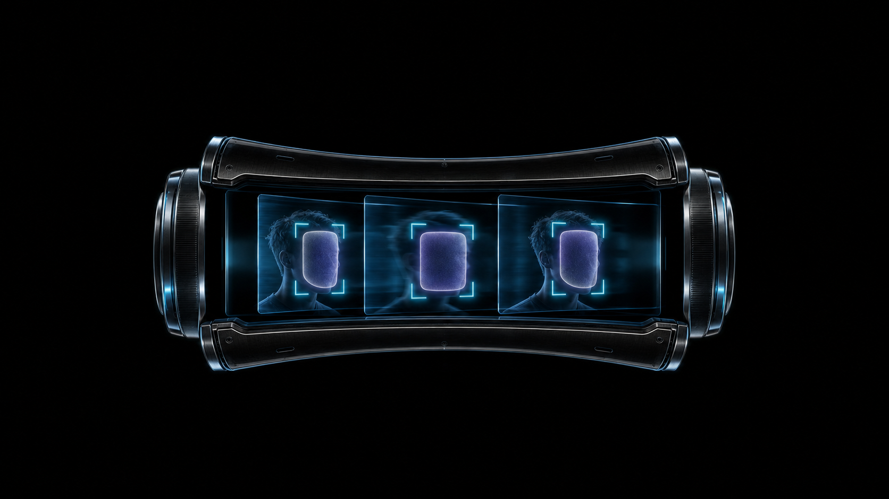
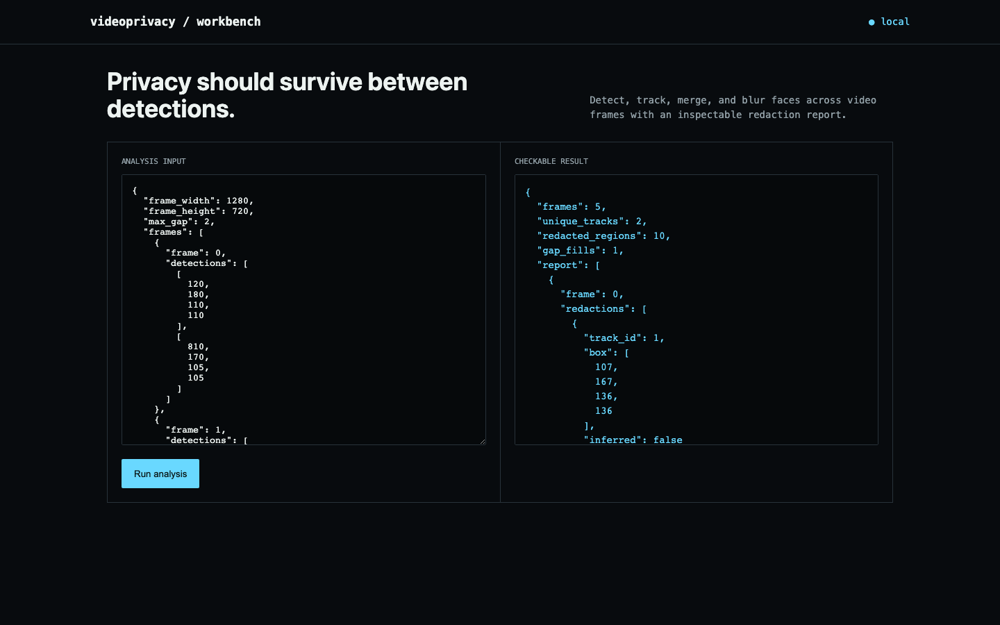

# videoprivacy

**A face detector misses one frame in five. If you blur frame-by-frame with no memory, that's one uncensored frame that gets published anyway.**



Face detectors are probabilistic — motion blur, a head turn, a bad angle, and the detection for an otherwise-tracked face just doesn't fire on frame 3. A naive redaction pipeline treats every frame as independent and blurs whatever it currently sees, which means that missed frame ships uncensored. videoprivacy tracks identities across frames instead of detecting them in isolation, so a gap gets bridged from where the face was last seen, not skipped.



## How it works

Match each frame's detections to existing tracks by IoU overlap, assign a new track ID only when nothing overlaps well enough, and keep a track alive for a configurable number of frames even with zero detections — inferring its box from the last known position instead of dropping coverage the moment the detector blinks. Every redaction region gets padded before blurring, because a tight bounding box around a face is still enough face to work with.

## What ships

- IoU-based multi-face tracking across frames, not per-frame independent detection
- Configurable gap tolerance that infers a face's position through missed detections
- Padded redaction boxes and an inspectable per-frame report of every region blurred
- CLI, JSON API, browser workbench, Docker, tests, and CI

## Run it end to end

```bash
python -m venv .venv && source .venv/bin/activate
python -m pip install -e .
videoprivacy demo
videoprivacy redact input.mp4 redacted.mp4
videoprivacy serve
```

Open <http://127.0.0.1:8090>. Analyze your own JSON input with `videoprivacy analyze input.json`.

## API

- `GET /api/demo` returns the committed fixture and result.
- `POST /api/analyze` runs the same engine on a JSON body.

## The result

Two identities cross five frames, and one of them has a detector miss right in the middle at frame 2. Track memory infers its position from frames 1 and 3, so all ten face-regions across the sequence stay covered instead of nine plus one gap. The integration test goes further than JSON: it writes a real three-frame MP4 with OpenCV and redacts it for real.

## Does the gap-bridging claim survive real stress?

The demo shows one gap on one track across five frames. Worth checking:
does the tracker's core safety invariant — every detected face gets
redacted, never silently dropped — hold up beyond that one fixture, and
does gap-filling actually improve coverage over naive per-frame detection
in general, or just in this specific arrangement?

```bash
python -m videoprivacy.eval_v2
```
```
tuning (40 seeds):  detections_ever_dropped=false (0/1200 frames)  naive_coverage=0.800  tracked_coverage=1.095  gain=+0.295
holdout (30 seeds): detections_ever_dropped=false (0/900 frames)   naive_coverage=0.793  tracked_coverage=1.062  gain=+0.269
```

`adversarial.py` simulates multiple people walking with continuous motion
and a 20% per-frame chance of a missed detection (the detector "blink"
this tool exists to bridge), across 40 tuning seeds and a disjoint
30-seed holdout evaluated once. Across all 2,100 simulated frames, not a
single real detection was ever silently dropped from the redaction
report — the tool's core safety property holds. Gap-filling delivers a
real, consistent coverage gain of roughly 27-30 percentage points over
naive per-frame detection on both sweeps, not just the one bundled
scenario. Coverage even exceeds 100% of the "true" face-frame count,
because a track stays alive for `max_gap` frames past someone's last real
appearance — the tool errs toward over-redaction at a track's end rather
than under-redaction, which is the right failure mode for a privacy
tool. This is a verification, not a bug fix: `core.py` is unmodified.

## Scope

The default local pipeline uses OpenCV's bundled frontal-face cascade for zero-setup operation — it works out of the box and it is not the detector you should ship. Production deployments need a domain-tested DNN detector with measured recall across pose, lighting, age, skin tone, motion blur, and camera geometry; this tracker is the layer that sits on top of whatever detector you actually trust.

## Test

```bash
python -m unittest discover -s tests -v
```

## Research basis

- [OpenCV DNN face detection](https://docs.opencv.org/master/d0/dd4/tutorial_dnn_face.html)

MIT licensed.
